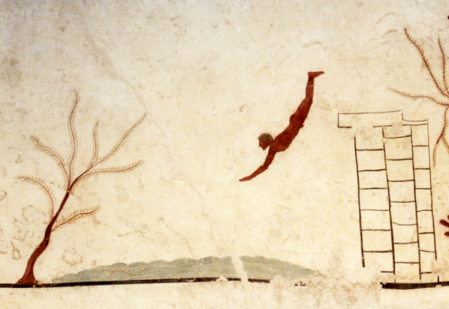

DeepDive.training | deepdive-eth-101
====================================

2017-11-24 | By [Marc Buma](http://www.bumos.nl/) & [Bart Roorda](http://bartroorda.nl/) | [DeepDive.training](http://deepdive.training)

**A deep dive into blockchain development using the Ethereum blockchain.**

# DeepDive.training - overview & goals

`[Table of Contents]`

Let's move some money around!

