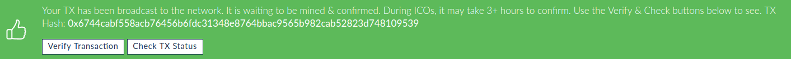

# Mission 2: Spend some cash

Goal: be able to create transactions and put them on the blockchain

In order to do something on the Ethereum blockchain, you need some cash. In this mission you will acquire some Ether and learn about accounts and transfers. These are the basic operations that you need to master first.

In this mission you will do this in two ways: first using an online wallet to get a good impression of the steps that are involved, secondly by issuing javascript commands. 

## Create your wallet

* Open the MyEtherWallet.com website. 

* Select the Ropsten Testnet in the upper left corner

* Now enter a password and create a new wallet. This generates a public/private key combination. Save the private key in an encrypted keystore file on disk (this file can only be unlocked with the password), next **store the private key at a safe location**. Also make a note of your public wallet address. You will be needing these two throughout the exercises. Anyone with access to your private key can spend your Ethers!

## Transfer some test Ether (using MyEtherWallet)

Get a paper wallet with test Ether. Go to "Send Ether & Tokens" on [https://www.myetherwallet.com](https://www.myetherwallet.com/#send-transaction) (Make sure that you are still using the Ropsten Testnet!) and use your private key to unlock your wallet. If all goes well, you should see a non zero balance in your account now.

<table>
  <tr>
    <td>QR-codes - The QR codes on the paper wallet can be scanned to import the private key and address of a wallet in your computer. For convenience, you can use https://webqr.com on your laptop to scan the codes. Never use third party sites like this to scan private keys for wallets that contain real currency as this presents a huge security risk! </td>
  </tr>
</table>

With your unlocked wallet, you can transfer ether to other wallets. Try to can transfer some ether to the wallet that you just created. You can also try send some ether to other participants in the course.

* First, decide how much ether you want to transfer

* Next, generate a transaction. MyEtherwallet will show you the transaction in "raw" form and also the same transaction data after it has been signed with your private key. The latter data will be sent to the mining nodes on the network.

* Finally send and confirm the transaction.

**While the transaction is being processed:**

* Copy the transaction id, you can use [http://ropsten.etherscan.io](http://ropsten.etherscan.io) to track the transaction as it is being processed:

    * What states does the transaction go through before the ether appears in your wallet?

    * Can you track where the coins on your paper wallet originate?

    * What do you think the following terms mean: block height, gas price, gas limit?

Congratulations! You have just created and executed a transaction on the ethereum blockchain. Take a moment to review the steps that you have taken so far. In the next part of the tutorial you will do the same while using the geth client from the commandline.

<table>
  <tr>
    <td>Important: 8545 vs 8544 - After executing the docker-compose up command, you have access to two separate blockchains. At port 8545 you can connect to the Test RPC blockchain (a private blockchain on your computer). At port 8544 you can connect to the Ropsten Test blockchain (a global blockchain). Please ensure that you are connecting to the correct network for the missions that follow.</td>
  </tr>
</table>

## Transfer some test Ether (using geth and Test RPC)

Now it is time to take a look at the Ethereum blockchain from the inside. For this you need to start the geth console on the Ropsten testnet. 

  # start geth console (Test RPC blockchain)

**docker exec -it geth sh**

**geth attach http://<your ip address>:8545**

First check what accounts are available on the local wallet. 

  **eth.accounts**

And how much ether is in the first account

  **web3.fromWei(eth.getBalance(eth.accounts[0]), 'ether');**

<table>
  <tr>
    <td>Wei: Wei is a denomination, like cents to Dollars. 1 ether = 10^18 wei

TestRPC: blocks are immediately mined when you send a transaction.</td>
  </tr>
</table>

In the test environment you can refer to eth.accounts[x] to get the address for each account. Now you can transfer some money! 

**amount = web3.toWei(1, "ether");**

**eth.sendTransaction({from:eth.accounts[0], to:eth.accounts[1], value: amount})**

You can **_eth.getTransaction()_** and **_eth.getBlock()_** to inspect what has happened behind the scenes. What are the new balances for each account? And what happens in the docker log when you do transactions? (execute **_docker logs testrpc -f_** in a new terminal window)

Do you think it is wise to transfer ether from this account to the account that you created with myetherwallet? Why?

Finally, close the geth console before you proceed.

**exit**

## Transfer some test Ether (using geth and Ropsten Testnet)

Now it is time to move to the Ropsten Test network. This means that transactions are sent to the blockchain and are checked and mined by other nodes on the network. You can use the online blockchain explorer ([http://ropsten.etherscan.io](http://ropsten.etherscan.io)) to look from the outside.

  # start geth console (Ropsten Testnet)

**geth attach http://localhost:8544**

First, import your paper wallet account into the local wallet (use an easy password for now, write down the key somewhere!)

**personal.importRawKey(****'****<private key>****'****, '<password>') **

You can check the result with your paper wallet address to double check. 

Next, unlock the account so that you can transfer funds. Set duration to 0 to keep it unlocked until the end of the session.

  

  **personal.unlockAccount('<address>', 'passwor****d'****, duration)** 

Now you can create a new account to transfer money to. Write down the address and password for the account. 

**personal.newAccount()**

Use the same command as before to transfer some Ether to the account you created with myetherwallet. Does the Ether appear in your online wallet afterwards?

**eth.sendTransaction({from:<address>, to:<address>, value: <numberofWei>})**

Now you can track the transaction either using eth.getTransaction() or using the external site. 

The javascript commands that you have used are known as the Geth Management API’s. You can read more at [ttps://github.com/ethereum/go-ethereum/wiki/Management-APIs](https://github.com/ethereum/go-ethereum/wiki/Management-APIs)

<table>
  <tr>
    <td>There is no way to export unencrypted private keys from the geth console. As a backup measure you can copy the encrypted keyfile in from the docker image to a safe location. You can then use the online wallet from myetherwallet.org  together with the password to retrieve the private key. (please keep in mind that these files disappear if you remove the docker image!)

Alternative: transfer the funds back to your paper wallet….</td>
  </tr>
</table>
