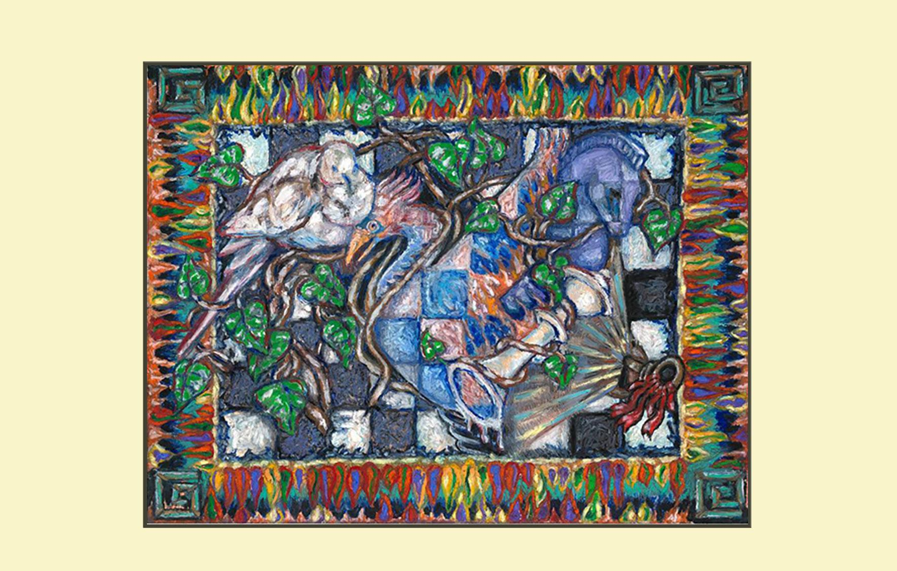

# Mission 4 - Fun with blockchains

A lot of people have only recently encountered blockchain technology. In practice, the technologies that combine into blockchain and other distributed ledgers have been around for the past two decades. The Bitcoin network began in 2009 when Satoshi Nakamoto "mined" the first Bitcoins and has thus been around for 8 years already.

One fun thing you can do is dive in the blockchain and lookup some memorable transactions and moments. Can you figure out what is special about these events?

* [Bitcoin transaction 4a5e1e4baab89f3a32518a88c31bc87f618f76673e2cc77ab2127b7afdeda33b](https://blockchain.info/tx/4a5e1e4baab89f3a32518a88c31bc87f618f76673e2cc77ab2127b7afdeda33b)

* [https://bitcointalk.org/index.php?topic=137.msg1195#msg1195](https://bitcointalk.org/index.php?topic=137.msg1195#msg1195)

* [https://blockchain.info/address/1GBwk2YJMDFqSVhTKygH8zUwV7jdoJhHHH](https://blockchain.info/address/1GBwk2YJMDFqSVhTKygH8zUwV7jdoJhHHH)

* [Len Sassaman](http://en.wikipedia.org/wiki/Len_Sassaman)

* [https://blockchain.info/largest-recent-transactions](https://blockchain.info/largest-recent-transactions)

As data can be stored in the blockchain, another fun trick is searching through texts that have been stored in the bitcoin blockchain. These texts are collected on the site [https://bitcoinstrings.com](https://bitcoinstrings.com/). By using a smart google filter "site:[https://bitcoinstrings.com](https://bitcoinstrings.com/) <subject>" you can search the blockchain for yourself. [Try it out]( https://www.google.nl/search?client=safari&rls=en&q=site:https://bitcoinstrings.com cappuccino&ie=UTF-8&oe=UTF-8&gfe_rd=cr&dcr=0&ei=9R8XWoDcCaTPXti1qNAB)!

Finally, if you like solving puzzles, this might be one to try. 

This painting from artist Marguerite Christine, ([Coin_Artist on Twitter](https://twitter.com/coin_artist)) contains a series of hidden clues that together form the private key for a bitcoin wallet containing 4.7 BTC. This can be yours if you manage to solve the puzzle. Although this represented a modest amount of money in 2015 when it was created, [it now represents a prize of more than 30.000 euro](https://www.reddit.com/r/Bitcoin/comments/31bho4/new_arg_puzzle_48btc_prize/). 
